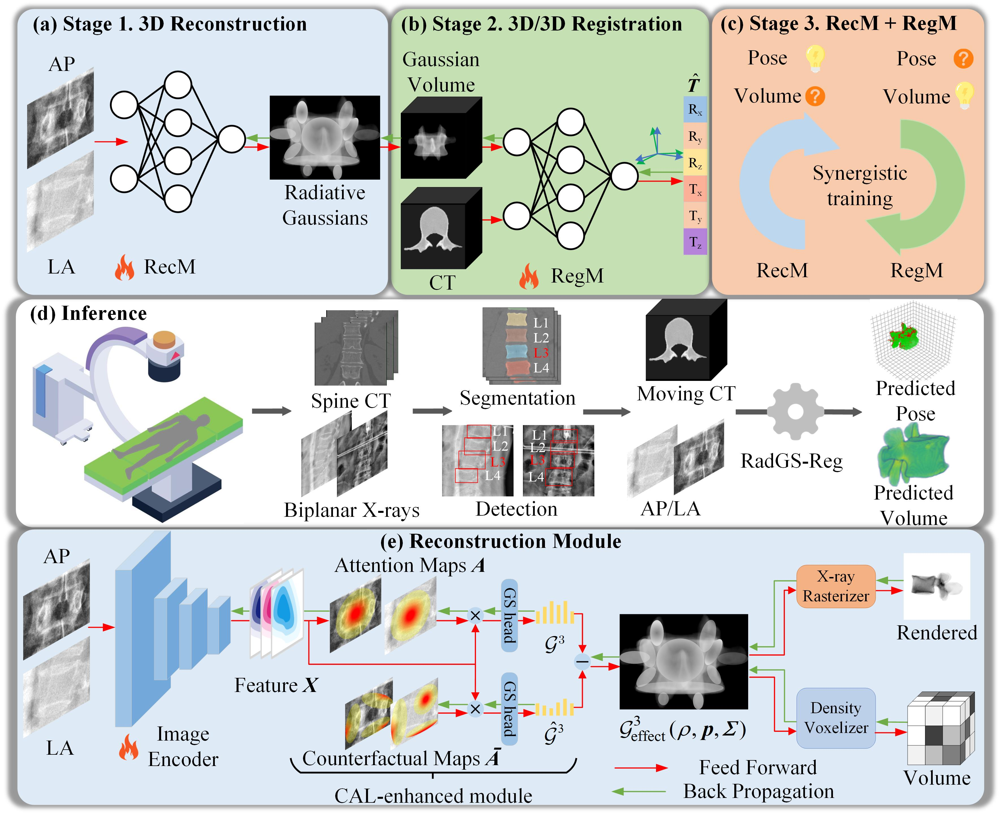

&nbsp;

<div align="center">

<p align="center">  </p>

[//]: # (![arXiv]&#40;https://img.shields.io/badge/paper-arxiv-179bd3&#41; )
[](https://arxiv.org/abs/2403.04116)

[//]: # ([![zhihu]&#40;https://img.shields.io/badge/知乎-解读-179bd3&#41;]&#40;https://zhuanlan.zhihu.com/p/717744222&#41;)

[//]: # ([![Youtube]&#40;https://img.shields.io/badge/video-youtube-red&#41;]&#40;https://www.youtube.com/watch?v=v6FESb3SkJg&t=28s&#41;)

[//]: # ([![AK]&#40;https://img.shields.io/badge/media-AK-green&#41;]&#40;https://x.com/_akhaliq/status/1765929288044290253?s=46&#41;)

[//]: # ([![MrNeRF]&#40;https://img.shields.io/badge/media-MrNeRF-green&#41;]&#40;https://x.com/janusch_patas/status/1766446189749150126?s=46&#41;)

[//]: # ([![RF]&#40;https://img.shields.io/badge/media-Radiance_Fields-green&#41;]&#40;https://radiancefields.com/x-gaussian-radiance-meets-radiation&#41;)
<h2> RadGS-Reg: Registering Spine CT with Biplanar X-rays via Joint 3D Radiative Gaussians Reconstruction and 3D/3D Registration </h2> 

*Vertebral-level CT/X-ray registration through joint 3D Radiative Gaussians (RadGS) reconstruction and 3D/3D registration.*





</div>


&nbsp;


### Introduction

This is the official repo of our MICCAI 2025 paper [RadGS-Reg: Registering Spine CT with Biplanar X-rays via Joint 3D Radiative Gaussians Reconstruction and 3D/3D Registration](https://arxiv.org/abs/2405.20693). If you find this repo useful, please give it a star ⭐ and consider citing our paper.

### News

[//]: # (* 2025.10.25: Code, data, and models have been released. Welcome to have a try!)

* 2025.05.13: Our work has been provisional accepted to MICCAI 2025.

[//]: # (* 2025.05.13: Our paper is available on [arxiv]&#40;https://arxiv.org/abs/2405.20693&#41;.)

## 1. Installation

Code, data and models will be released by June 30, 2025.

[//]: # (We recommend using [Conda]&#40;https://docs.conda.io/en/latest/miniconda.html&#41; to set up an environment. We tested the code on Ubuntu 20.04 with an RTX 3090 GPU. For installation issues on other platforms, please refer to [Gaussian Splatting]&#40;https://github.com/graphdeco-inria/gaussian-splatting&#41;.)

[//]: # (```sh)

[//]: # (# Download code)

[//]: # (git clone https://github.com/Ruyi-Zha/r2_gaussian.git --recursive)

[//]: # ()
[//]: # (# Install environment)

[//]: # (SET DISTUTILS_USE_SDK=1 # Windows only)

[//]: # (conda env create --file environment.yml)

[//]: # (conda activate r2_gaussian)

[//]: # ()
[//]: # (# Install TIGRE for data generation and initialization)

[//]: # (wget https://github.com/CERN/TIGRE/archive/refs/tags/v2.3.zip)

[//]: # (unzip v2.3.zip)

[//]: # (pip install TIGRE-2.3/Python --no-build-isolation)

[//]: # (```)

## 2. Dataset


## 3. Running

### 3.1 Initialization (optional)


### 3.2 Training


### 3.3 Evaluation


## 4. Generate your own data


## 5. Acknowledgement, license and citation

[//]: # (Our code is adapted from [Gaussian Splatting]&#40;https://github.com/graphdeco-inria/gaussian-splatting&#41;, [SAX-NeRF]&#40;https://github.com/caiyuanhao1998/SAX-NeRF&#41;, [NAF]&#40;https://github.com/Ruyi-Zha/naf_cbct&#41; and [TIGRE toolbox]&#40;https://github.com/CERN/TIGRE.git&#41;. We thank the authors for their excellent works.)

[//]: # ()
[//]: # (This project is under the license of [Gaussian Splatting]&#40;https://github.com/graphdeco-inria/gaussian-splatting&#41;.)

[//]: # ()
[//]: # (If this repo helps you, please consider citing our work:)

[//]: # ()
[//]: # (```)

[//]: # (@inproceedings{r2_gaussian,)

[//]: # (  title={R$^2$-Gaussian: Rectifying Radiative Gaussian Splatting for Tomographic Reconstruction},)

[//]: # (  author={Ruyi Zha and Tao Jun Lin and Yuanhao Cai and Jiwen Cao and Yanhao Zhang and Hongdong Li},)

[//]: # (  booktitle = {Advances in Neural Information Processing Systems &#40;NeurIPS&#41;},)

[//]: # (  year={2024})

[//]: # (})

[//]: # (```)
