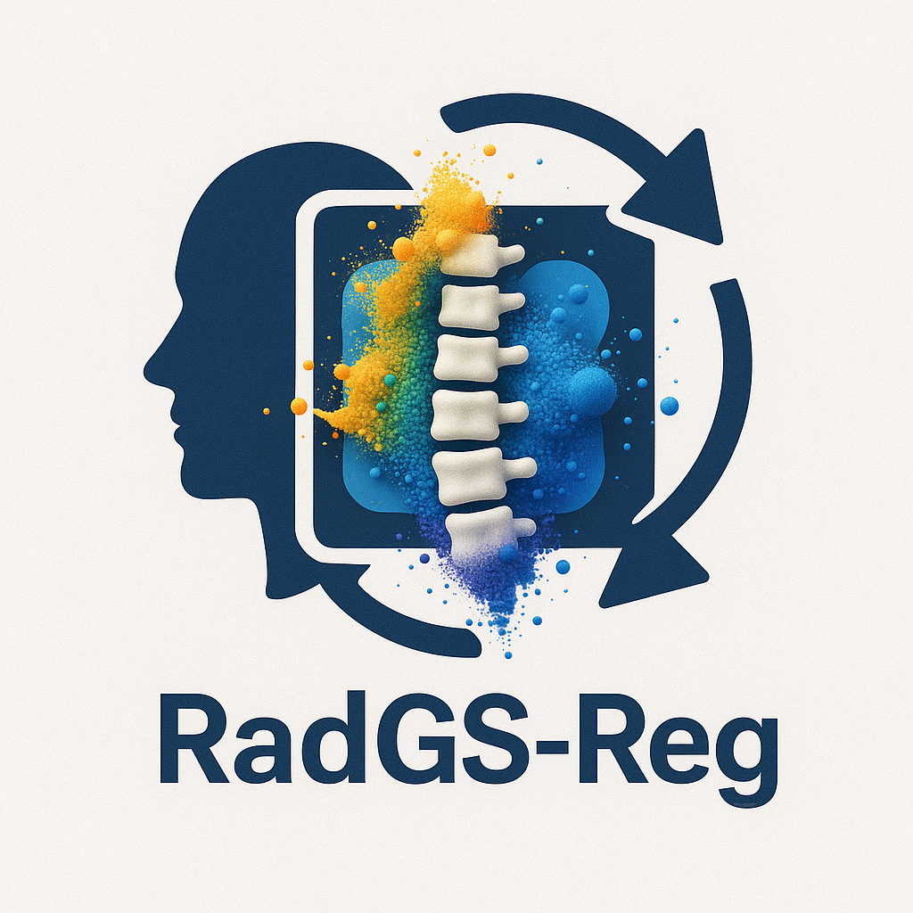

# RadGS_Reg
Vertebral-level CT/X-ray registration through joint 3D Radiative Gaussians (RadGS) reconstruction and 3D/3D registration.
&nbsp;

<div align="center">

<p align="center">  </p>

[Arxiv](https://arxiv.org/abs/2405.20693) | [Data](https://drive.google.com/drive/folders/1YZ3w87XrCNyjDRos6gkY8zgT5hESl-PN?usp=sharing) | [Models](https://drive.google.com/drive/folders/1HIvO7aS2gbp7Qx3ceHiRSNoAKKS_VnjU?usp=sharing) | [Project](https://ruyi-zha.github.io/r2_gaussian/r2_gaussian.html)

<h2> Rectifying Radiative Gaussian Splatting for Tomographic Reconstruction </h2> 

*Fast and direct CT reconstruction with 3D Gaussian Splatting.*


</div>


&nbsp;


### Introduction

This is the official repo of our NeurIPS 2024 paper [R<sup>2</sup>-Gaussian: Rectifying Radiative Gaussian Splatting for Tomographic Reconstruction](https://arxiv.org/abs/2405.20693). If you find this repo useful, please give it a star ⭐ and consider citing our paper.

### News

* 2024.10.25: Code, data, and models have been released. Welcome to have a try!
* 2024.09.27: Our work has been accepted to NeurIPS 2024.
* 2024.05.31: Our paper is available on [arxiv](https://arxiv.org/abs/2405.20693).

## 1. Installation

We recommend using [Conda](https://docs.conda.io/en/latest/miniconda.html) to set up an environment. We tested the code on Ubuntu 20.04 with an RTX 3090 GPU. For installation issues on other platforms, please refer to [Gaussian Splatting](https://github.com/graphdeco-inria/gaussian-splatting).

```sh
# Download code
git clone https://github.com/Ruyi-Zha/r2_gaussian.git --recursive

# Install environment
SET DISTUTILS_USE_SDK=1 # Windows only
conda env create --file environment.yml
conda activate r2_gaussian

# Install TIGRE for data generation and initialization
wget https://github.com/CERN/TIGRE/archive/refs/tags/v2.3.zip
unzip v2.3.zip
pip install TIGRE-2.3/Python --no-build-isolation
```

## 2. Dataset


## 3. Running

### 3.1 Initialization (optional)


### 3.2 Training


### 3.3 Evaluation


## 4. Generate your own data


## 5. Acknowledgement, license and citation

Our code is adapted from [Gaussian Splatting](https://github.com/graphdeco-inria/gaussian-splatting), [SAX-NeRF](https://github.com/caiyuanhao1998/SAX-NeRF), [NAF](https://github.com/Ruyi-Zha/naf_cbct) and [TIGRE toolbox](https://github.com/CERN/TIGRE.git). We thank the authors for their excellent works.

This project is under the license of [Gaussian Splatting](https://github.com/graphdeco-inria/gaussian-splatting).

If this repo helps you, please consider citing our work:

```
@inproceedings{r2_gaussian,
  title={R$^2$-Gaussian: Rectifying Radiative Gaussian Splatting for Tomographic Reconstruction},
  author={Ruyi Zha and Tao Jun Lin and Yuanhao Cai and Jiwen Cao and Yanhao Zhang and Hongdong Li},
  booktitle = {Advances in Neural Information Processing Systems (NeurIPS)},
  year={2024}
}
```
